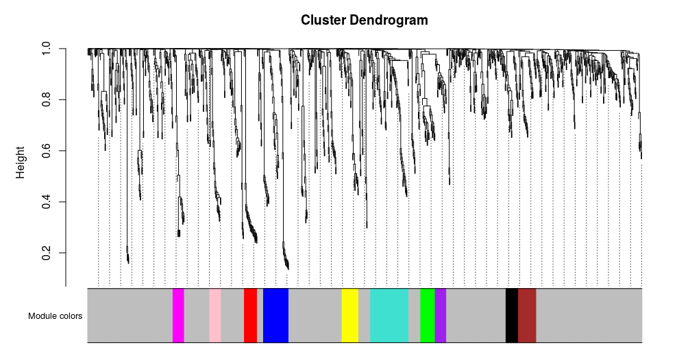
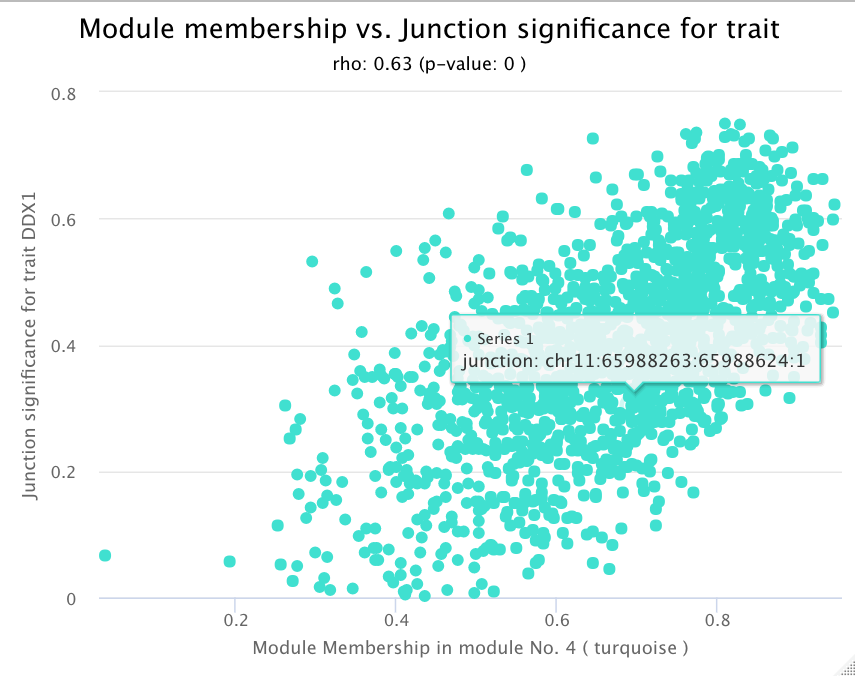

DJExpress README
================
Lina Marcela Gallego-Paez
22/10/2021

-   [1 Installation](#installation)
-   [2 Details](#details)
-   [3 Example DJE analysis](#example-dje-analysis)
    -   [3.1 Import junction quantification files with
        DJEimport()](#import-junction-quantification-files-with-djeimport)
    -   [3.2 Annotate junctions with their respective gene of origin
        with
        DJEannotate()](#annotate-junctions-with-their-respective-gene-of-origin-with-djeannotate)
    -   [3.3 Filtering junctions for differential expression analysis
        using
        DJEprepare()](#filtering-junctions-for-differential-expression-analysis-using-djeprepare)
    -   [3.4 Test for Differential Junction Expression using
        DJEanalize()](#test-for-differential-junction-expression-using-djeanalize)
    -   [3.5 Gene-wise Splice plots](#gene-wise-splice-plots)
    -   [3.6 Association between junction expression and external traits
        with
        DJEvsTrait()](#association-between-junction-expression-and-external-traits-with-djevstrait)
-   [4 Example Junction Co-expression Network Analysis
    (JCNA)](#example-junction-co-expression-network-analysis-jcna)
    -   [4.1 Prepare data for JCNA
        1-pass](#prepare-data-for-jcna-1-pass)
    -   [4.2 1-pass JCNA](#1-pass-jcna)
    -   [4.3 2-pass JCNA](#2-pass-jcna)

# 1 Installation

The devtools package provides install\_github() that allows you to
install the package from GitHub **(this option will be available once
the repository becomes public)**:

``` r
install.packages("devtools") # if you have not installed "devtools" package
devtools::install_github("MauerLab/DJExpress")
```

DJExpress can be also installed from the source (DJExpress\_0.1.0.tar.gz
file available with granted access at
<https://gitlab.com/MauerLab/djexpress-source-file>) file using
install.packages():

``` r
install.packages(path_to_DJExpress_sourcefile, repos = NULL, type="source")
```

# 2 Details

The DJExpress package provides several convenient functions for
Differential Junction Expression analysis (DJE) as well as Junction
Co-expression Network Analysis (JCNA):

-   DJEimport()

-   DJEannotate()

-   DJEprepare()

-   DJEanalize()

-   DJEvsTrait()

-   DJEplotSplice()

-   DJEspliceRadar()

-   JCNAprepare()

-   JCNA1pass()

-   JCNAgenePrepare()

-   JCNA2pass()

-   JCNAModTrait()

# 3 Example DJE analysis

DJExpress uses two types of files as the primary input for DJE analysis:

1.  STAR aligner-derived “SJ.out.tab” files containing splice junction
    counts per sample (generated from FASTQ or BAM files) in
    tab-delimited format, or outputs from any other junction
    quantification tool as long as they contain junction IDs as first
    columns, following the format chr:start:end:strand
    (e.g. chr1:123:456:1, where positive or negative strand are coded as
    1 and 2, respectively)

2.  The correspondent transcriptome annotation (gtf file) used for
    junction quantification.

## 3.1 Import junction quantification files with DJEimport()

The first step in the DJE analysis is to merge “SJ.out.tab” files into a
single expression matrix (in case the primary input contains individual
files per sample) and to generate a matrix of junction coordinates for
junction-to-gene mapping. The input for DJEimport() is the path to the
folder where these junction quantification files are located.

As an example, we are going to use a few “SJ.out.tab” files produced by
STAR alignment using 3 TCGA colorectal (COADREAD) tumor samples and 3
matching normal colon samples from GTEx:

``` r
library(DJExpress)
in.file <- system.file("extdata", "junct.quant", package = "DJExpress")
print(in.file)
```

    ## [1] "/Users/paez/Library/R/4.0/library/DJExpress/extdata/junct.quant"

You can see that **in.file** contains the path to the folder
(“junct.quant”) where “SJ.out.tab” files from STAR alignment are found.

This is how individual “SJ.out.tab” files look like:

``` r
files <- list.files(in.file)
junctions <- readr::read_tsv(paste0(in.file,"/", files[1]), comment = "", col_names = FALSE)
head(junctions)
```

    ## # A tibble: 6 x 9
    ##   X1       X2    X3    X4    X5    X6    X7    X8    X9
    ##   <chr> <dbl> <dbl> <dbl> <dbl> <dbl> <dbl> <dbl> <dbl>
    ## 1 chr1  14830 14929     2     2     1     2     0    29
    ## 2 chr1  14830 14969     2     2     1    19   275    38
    ## 3 chr1  14830 15020     2     2     1     0    12    18
    ## 4 chr1  15013 25232     1     1     1     0     1    13
    ## 5 chr1  15039 15795     2     2     1     4   115    37
    ## 6 chr1  15039 16853     2     2     1     0    10     1

Now, let’s generate the junction quantification matrix and the
respective junction coordinates matrix. We are going to determine that 3
reads per junction is the minimal number of reads for a junction to be
considered expressed in the sample (this is the default value for
**min.expressed** in DJEimport():

``` r
out.file <- DJEimport(workDir = in.file, aligner="STAR", min.expressed = 3)
# summary of out.file:
summary(out.file)
```

    ##       Length Class      Mode
    ## quant 6      data.frame list
    ## coord 5      data.frame list

``` r
# Head of out.file$quant:
head(out.file$quant)
```

    ##                    GTEx1.aligned.bam.junctions GTEx2.aligned.bam.junctions
    ## chr1:14830:14929:2                           0                           0
    ## chr1:14830:14969:2                          19                          71
    ## chr1:14830:15020:2                           0                           0
    ## chr1:15013:25232:1                           0                           0
    ## chr1:15039:15795:2                           4                          30
    ## chr1:15039:16853:2                           0                           0
    ##                    GTEx3.aligned.bam.junctions TCGA1.aligned.junctions
    ## chr1:14830:14929:2                           0                       0
    ## chr1:14830:14969:2                           9                       0
    ## chr1:14830:15020:2                           0                       0
    ## chr1:15013:25232:1                           0                       0
    ## chr1:15039:15795:2                           0                       9
    ## chr1:15039:16853:2                           0                       0
    ##                    TCGA2.aligned.junctions TCGA3.aligned.junctions
    ## chr1:14830:14929:2                       0                       0
    ## chr1:14830:14969:2                      13                       0
    ## chr1:14830:15020:2                       0                       0
    ## chr1:15013:25232:1                       0                       0
    ## chr1:15039:15795:2                      15                       0
    ## chr1:15039:16853:2                       0                       0

``` r
# Head of out.file$coord:
head(out.file$coord)
```

    ##    chr start   end strand        junction_id
    ## 1 chr1 14830 14929      - chr1:14830:14929:2
    ## 2 chr1 14830 14969      - chr1:14830:14969:2
    ## 3 chr1 14830 15020      - chr1:14830:15020:2
    ## 4 chr1 15013 25232      + chr1:15013:25232:1
    ## 5 chr1 15039 15795      - chr1:15039:15795:2
    ## 6 chr1 15039 16853      - chr1:15039:16853:2

## 3.2 Annotate junctions with their respective gene of origin with DJEannotate()

We now need to associate junctions found in **out.file** to their
respective gene, so gene-level differential junction usage can be
calculated downstream in the analysis.

For this step we need the path to the transcriptome annotation file (or
gtf file) and the output object of DJEimport(). We are going to use an
example gtf file containing only chromosome 1 (chr1) for simplicity:

``` r
# Get path to gtf file:
gtf0 <- system.file("extdata", "chr1.gtf.gz", package = "DJExpress")
print(gtf0)
```

    ## [1] "/Users/paez/Library/R/4.0/library/DJExpress/extdata/chr1.gtf.gz"

``` r
# Run DJEannotate():
ann.out <- DJEannotate(import.out = out.file, gtf = gtf0)

# Summary of ann.out:
summary(ann.out)
```

    ##                 Length Class      Mode     
    ## quant.annotated   6    data.frame list     
    ## featureID       420    -none-     character
    ## groupID         420    -none-     character

``` r
# head of ann.out$quant.annotated (the junction quantification matrix)
head(ann.out$quant.annotated)
```

    ##                    GTEx1.aligned.bam.junctions GTEx2.aligned.bam.junctions
    ## chr1:14830:14929:2                           0                           0
    ## chr1:14830:14969:2                          19                          71
    ## chr1:14830:15020:2                           0                           0
    ## chr1:15039:15795:2                           4                          30
    ## chr1:15039:16853:2                           0                           0
    ## chr1:15943:16606:2                           0                           3
    ##                    GTEx3.aligned.bam.junctions TCGA1.aligned.junctions
    ## chr1:14830:14929:2                           0                       0
    ## chr1:14830:14969:2                           9                       0
    ## chr1:14830:15020:2                           0                       0
    ## chr1:15039:15795:2                           0                       9
    ## chr1:15039:16853:2                           0                       0
    ## chr1:15943:16606:2                           0                       0
    ##                    TCGA2.aligned.junctions TCGA3.aligned.junctions
    ## chr1:14830:14929:2                       0                       0
    ## chr1:14830:14969:2                      13                       0
    ## chr1:14830:15020:2                       0                       0
    ## chr1:15039:15795:2                      15                       0
    ## chr1:15039:16853:2                       0                       0
    ## chr1:15943:16606:2                       6                       0

``` r
# head of ann.out$featureID (the junction ID list)
head(ann.out$featureID)
```

    ## [1] "chr1:14830:14929:2" "chr1:14830:14969:2" "chr1:14830:15020:2"
    ## [4] "chr1:15039:15795:2" "chr1:15039:16853:2" "chr1:15943:16606:2"

``` r
# head of ann.out$groupID (the junction-associated gene list)
head(ann.out$groupID)
```

    ## [1] "WASH7P" "WASH7P" "WASH7P" "WASH7P" "WASH7P" "WASH7P"

## 3.3 Filtering junctions for differential expression analysis using DJEprepare()

Once we have junctions annotated with their respective gene of origin
within **ann.out**, we can now filter them based on user-defined
expression cutoffs.

For this step, we need to provide the sample names (as defined by the
colnames in ann.out$quant.annotated) that correspond to the basal
experimental condition (e.g. WT/normal condition, non-treated condition,
etc). In the case of this example, the GTEx normal colon samples
correspond to our basal experimental condition.

Additionally, we are going to use the default expression cutoffs for
DJEprepare (minimum of read count mean per junction - **minMean** of 10
reads and minimum of read count variance per junction - **minVar** of
0):

``` r
Group1 <- colnames(ann.out$quant.annotated)[grep("GTEx", colnames(ann.out$quant.annotated))]
print(Group1) # GTEx sample names
```

    ## [1] "GTEx1.aligned.bam.junctions" "GTEx2.aligned.bam.junctions"
    ## [3] "GTEx3.aligned.bam.junctions"

``` r
# Run DJEprepare
prep.out <- DJEprepare(annotate.out = ann.out, Group1 = Group1,
                       minMean = 10,maxMean = Inf,minVar = 0,maxVar = Inf) # these are the default values for minMean, maxMean, minVar and MaxVar

# Summary of prep.out
summary(prep.out)
```

    ##               Length Class      Mode     
    ## JunctExprfilt  6     data.frame list     
    ## featureID     38     -none-     character
    ## groupID       38     -none-     character
    ## design        12     -none-     numeric

DJEprepare() contains expression-based filtered junction counts, gene
annotation and design matrix for differential expression analysis

## 3.4 Test for Differential Junction Expression using DJEanalize()

At this point we have all the data we need for the differential junction
expression analysis.

An FDR cutoff of 0.05 and a minimal absolute log-fold change (logFC) of
2 are default paramenters for DJEanalize(). Users are free to explore
and modify the multiple options for the function (type ?DJEanalize for
more details):

``` r
# Run DJEanalize
anlz.out <- DJEanalize(prepare.out = prep.out, Group1 = Group1,
                       FDR = 0.05, logFC = 2)
```

    ## Total number of junctions:  38 
    ## Total number of genes:  4 
    ## Number of genes with 1 junction:  1 
    ## Mean number of junctions in a gene:  10 
    ## Max number of junctions in a gene:  19

With DJEanalize, a tests for differential junction expression is
implemented using voom’s log2-counts per million (logCPM) and
observation-level weights based on mean-variance relationship (stored at
**anlz.out$v.norm**).

A linear model is then fit per junction using a provided experimental
design, and empirical Bayes moderated t-statistics are implemented to
assess the significance level of the observed expression changes.

The linear model framework of limma is also used in parallel to
calculate differential junction usage, where significant differences in
log-fold-changes in the fit model between junctions from the same gene
are tested (using the diffSplice function from limma and stored at
**anlz.out$ex.norm**).

DJExpress thereby identifies alternatively spliced regions in
transcripts based on two main features of splice junction expression: 1)
Quantitative changes in the abundance of individual junctions between
experimental groups, and 2) Differences in their expression levels
compared to the average expression of other junctions in the gene.

Following these criteria, splice junctions are classified based on their
absolute log-fold change (e.g. experimental condition A vs B) and their
relative log-fold change (target junction vs all other junctions in the
gene) in one of the following expression groups:

-   **Group 0**: Junctions without differential expression or
    differential usage.
-   **Group 1**: Junctions with equal levels of differential expression
    and differential usage, reflecting changes in splicing patterns
    between experimental conditions (in this case, both absolute and
    relative log-fold change values are similar, if not the same).
-   **Group 2**: Junctions with differential expression but no
    differential usage or vice-versa, implying the occurrence of
    generalized changes in expression across the gene, rather than the
    presence of a differentially spliced region (in this case, either
    the absolute or relative log-fold change value is not significant).
-   **Group 3**: Junctions with divergent levels of differential
    expression and differential usage, indicating concomitant changes in
    splicing and total gene expression (in this case, the absolute and
    relative log-fold change values can substantially vary from each
    other).

Let’s check the summary of **anlz.out** object:

``` r
summary(anlz.out)
```

    ##              Length Class      Mode
    ## v.norm        4     EList      list
    ## ex.norm      17     MArrayLM   list
    ## dje.out      25     data.frame list
    ## dje.sig       0     -none-     NULL
    ## logFC.plot    0     -none-     NULL
    ## volcano.plot  0     -none-     NULL
    ## model.fit     0     -none-     NULL
    ## group.par     0     -none-     NULL

-   **v.norm** correspond to the log-cpm values outputed by limma:voom
-   **ex.norm** contains the differential junction expression analysis
    output
-   **dje.out** correspond to the annotated **ex.norm** data set with
    additional information, including basic statistics (e.g. median,
    zero counts, etc) and DJE group for each junction.
-   **dje.sig** a subset of **dje.out** containing significant hits
    based on FDR and logFC cutoffs and the expression group of each
    junction.
-   **logFC.plot** Shows the regression plot of Absolute logFC \~
    Relative logFC for differentially expressed junctions (basal vs
    tested sample group)
-   **volcano.plot** Volcano plot of differential junction expression
-   **model.fit** Correspond to the confidence and prediction intervals
    for the linear regression (Absolute logFC \~ Relative logFC)
    required to define the expression group of each junction.
-   **group.par** Indicates the “Group” type for each junction (Group
    0,1,2 or 3) based on its position within the “relative vs absolute
    logFC” regression plot (**logFC.plot**) whose parameters are defined
    by the fit model (**model.fit**), and user-defined FDR and logFC
    cutoffs.

For most users, the top relevant element in DJEanalize() output object
is **dje.sig** , a data frame with the differentially expressed
junctions considered significant based on the FDR and logFC cutoffs
*(for this particular example, since the gtf used only contained chr1
-and consequently, only genes in this chromosome- there were no
differentially expressed junctions detected and thus **dje.sig**,
**logFC.plot**, **volcano.plot**, **model.fit** and **group.par** are
not produced).*

The summary statistics and additional information about all junctions
analized by DJExpress() can be found in **dje.out**:

``` r
head(anlz.out$dje.out)
```

    ##             junctionID     GeneID     logFC          t    P.Value       FDR
    ## 1 chr1:569491:569920:2 AL669831.3 -7.399331 -2.4981874 0.01357649 0.4060932
    ## 2 chr1:569199:569362:2 AL669831.3 -6.920520 -2.3156498 0.02195099 0.4060932
    ## 3 chr1:568990:569195:2 AL669831.3  3.883564  1.4650514 0.14502801 0.9320353
    ## 4 chr1:569158:569317:2 AL669831.3 -3.658810 -1.1936361 0.23453015 0.9320353
    ## 5   chr1:15948:16606:2     WASH7P  3.528810  1.0169887 0.31081845 0.9320353
    ## 6 chr1:569297:569340:2 AL669831.3  2.318959  0.7760885 0.43893519 0.9320353
    ##   medianExp.group1   meanExp.group1 medianExp.group2   meanExp.group2
    ## 1                0 204.333333333333                0                0
    ## 2                0 150.333333333333                0                0
    ## 3                0                0               71 63.6666666666667
    ## 4                0               94                0                0
    ## 5                0               19                4 6.33333333333333
    ## 6                0                0                0 394.666666666667
    ##   medianNormExp.group1 meanNormExp.group1 medianNormExp.group2
    ## 1     10.8601062067676   13.3887641130092     7.44121906358489
    ## 2     10.8601062067676   13.2413183276152     7.44121906358489
    ## 3     10.2985733721812   9.96845760178822     14.6417753676264
    ## 4     10.8601062067676   13.0158266208891     7.44121906358489
    ## 5     10.2985733721812   12.2502876187697     10.6518290322903
    ## 6     10.2985733721812   9.96845760178822     7.44121906358489
    ##   meanNormExp.group2 group1WithCounts group2WithCounts zeroCounts.group1
    ## 1   7.44830555314337                1                0                 2
    ## 2   7.44830555314337                1                0                 2
    ## 3   12.4725591108128                0                2                 3
    ## 4   7.44830555314337                1                0                 2
    ## 5   10.1563459904198                1                2                 2
    ## 6   11.1849930475568                0                1                 3
    ##   zeroCounts.group2 neojunction logFC.ebayes AveExpr.ebayes   t.ebayes
    ## 1                 3        <NA>    -7.790190       10.41853 -2.4486829
    ## 2                 3        <NA>    -7.363267       10.34481 -2.2917382
    ## 3                 1 neojunction     2.447053       11.22051  0.8708416
    ## 4                 3        <NA>    -4.388091       10.23207 -1.3283461
    ## 5                 1        <NA>    -1.675349       11.20332 -0.4402782
    ## 6                 2 neojunction     1.110836       10.57673  0.3458094
    ##   P.Value.ebayes adj.P.Val.ebayes  B.ebayes
    ## 1     0.01547513        0.4425836 -4.592654
    ## 2     0.02329387        0.4425836 -4.593063
    ## 3     0.38521396        0.7921862 -4.595273
    ## 4     0.18605478        0.7921862 -4.594770
    ## 5     0.66036110        0.9934724 -4.595398
    ## 6     0.72996414        0.9934724 -4.595546

The column **neojunction** specifies the junctions that are uniquely
found in the tested condition (TCGA tumor samples in this example) and
never found in any sample from the basal condition.

When a junction annotation file is provided as an additional input to
DJEanalize() (), **dje.out** contains an additional column called
**annotation**, where junctions not found in the gtf transcriptome
annotation file are indicated as ***unnanotated***.

***Note**: A junction annotation file can be produced using the JAn()
function in DJExpress. users need to provide the path to the gtf file
and JAn() generates a data frame with all exon-exon junctions found in
the gft and their correspondent gene ID (this can take some time
depending on the size of the gtf file).*

``` r
gtf <- system.file("extdata", "chr1.gtf.gz", package = "DJExpress")
Jan.out <- JAn(gtf)

head(Jan.out)
```

    ##                gene           junction
    ## 1 ENSG00000223972.5 chr1:12228:12612:1
    ## 2 ENSG00000223972.5 chr1:12722:13220:1
    ## 3 ENSG00000223972.5 chr1:12058:12178:1
    ## 5 ENSG00000223972.5 chr1:12698:12974:1
    ## 6 ENSG00000223972.5 chr1:13053:13220:1
    ## 7 ENSG00000223972.5 chr1:13375:13452:1

## 3.5 Gene-wise Splice plots

One of the main features of DJExpress is the generation of interactive
gene-wise junction plots using **DJEplotSplice()** function. This type
of representation facilitates straight-forward visual inspection of
differential splicing across a gene of interest and exploration of
supplementary information about each junction’s expression, including
the above-mentioned classification based on absolute and relative
log-fold change patterns and basic statistics on expression levels
(e.g. mean and median expression in each experimental condition, number
of samples expressing the junction, etc.).

As example, we show here the gene-wise splice plot for the ENAH gene
indicating the presence of an exon inclusion event in tumor samples:

``` r
# load DJEanalize ouptut object (30 TCGA COADREAD tumor vs 30 GTEx colon tissue samples):
data(DJEanlz)

# generate gene-wise splice plot:
iPlot.out <- DJEplotSplice(DJEanlz, geneID="ENAH", logFC = 0.5, FDR = 0.05)
iPlot.out$plot
```


Up- and down-regulted Junctions (with both relative and absolute logFC
values above the specified threshold) are shown in red and blue,
respectively. The user can explore further statistical information about
each individual junction by hoovering over the junction dots in the
plot, which displays a box with summarized DJE information, including
relative and absolute logFC values, FDR values and expression group of
the selected junction.

When the path to a gtf file is provided, iPlot.out object contains an
additional gene model plot with exon-to-protein domain annotation and
the localization of a user-selected junction (e.g. the exon skipping
junction downregulated in ENAH):


Colors within exonic regions in the gene model plot indicate the
presence of protein domains and/or post-translational modifications
(PTMs). The position of the selected junction within the gene model plot
is indicated by a dashed arc whose color correspond to the type of
differential expression (blue for downregulation and red for
upregulation).

This visualization strategy facilitates straight-forward visual
inspection of differential splicing across the entire gene (not
restricted to individual local splicing events) and exploration of
supplementary information about each junction’s expression, including
the relative position of target alternative splicing events to protein
domains and PTMs, which further facilitates the undestanding of the
functional consequences of such alterations in transcript and protein
structure.

## 3.6 Association between junction expression and external traits with DJEvsTrait()

In order to explore the physiologic significance of target alternative
splicing events, the user can make associations between junction
expression and external sample traits (e.g. clinical data, mutation
data, gene expression, etc) when available.

**DJEvsTrait()** function recieves as input:

1.  a **DJEanalize** output object (analize.out), and
2.  a numeric vector or a matrix of external sample traits (traitData).

User should also indicate the experimental condition that should be
excluded from the junction-trait association test (Group1, we want to
keep only tumor sample data).

**DJEvsTrait()** offers two type of association test: association based
on correlation, or association based on regression (test.type).

In the case of correlation analysis, **DJEvsTrait()** executes a big
matrix correlation test (“bicor”, “pearson”, “kendall” or “spearman”)
between the normalized junction expression contained within the
**DJEanalize** output object and values in the trait data, for the
selected samples in **Group1**. The return object contains the matrices
with correlation coefficients and associated P-values for each
junction-trait pair.

When regression analysis is selected, **DJEvsTrait()** uses large matrix
operations adapted from the ***Matrix eQTL*** algorithms
(<http://www.bios.unc.edu/research/genomic_software/Matrix_eQTL/>) and
returns a data frame with significant junction-trait associations based
on the selected model in **useModel** (modelLINEAR, modelANOVA or
modelLINEAR\_CROSS).

Users have the additional option to supply a specific set of target
junctions (maximum 5 junction IDs) to generate SpliceRadar plots (using
**DJEspliceRadar** function) when test.type = “Correlation”.

For our example, we are going to use the expression of genes known to
code for splicing factors as external trait data from the TCGA COADREAD
samples. Our aim is to test potential associations between the
expression levels of splicing factors and the expression of splice
junctions, which could contribute to the characterization of regulatory
networks controlling alternative splicing events of interest.

Our example trait data looks like this:

``` r
SF <- system.file("extdata", "SF.expr.rds", package = "DJExpress")
SF.exp <- readRDS(SF)
print(SF.exp[,c(1:8)], row.names = FALSE)
```

    ##     ACIN1    AGGF1      AQR   ARGLU1     BAG2      BCAS1    BCAS2     BUB3
    ##  7.552864 5.587345 6.066815 7.076861 2.074548  4.3489730 4.494495 6.478300
    ##  7.053783 5.416257 4.330139 8.234791 2.230377  5.1375484 4.106623 7.122091
    ##  7.545562 5.097509 5.660424 7.551051 3.282097  6.4118113 4.770974 7.290347
    ##  7.381274 4.710511 5.348603 6.641707 4.510515  3.2940607 4.182552 7.234991
    ##  7.446583 4.644171 5.170452 6.859362 5.155595 -0.5479771 4.940280 6.876452
    ##  7.146317 5.147694 5.094728 7.849169 2.477678  2.4382041 4.782368 6.909769
    ##  6.538969 4.753975 4.666928 7.444170 4.952424  4.2047463 4.530543 7.103473
    ##  7.076956 4.982824 5.109519 6.120249 2.863316  6.3985415 4.808807 6.746150
    ##  7.189313 3.854566 5.113996 5.519869 3.421598  3.0286828 4.355646 7.424761
    ##  6.615288 4.500616 5.127311 5.957938 4.170996  4.6175814 5.412729 6.713595
    ##  6.069404 4.920051 4.398614 7.865325 3.211644  2.9211268 4.805560 7.008063
    ##  6.960877 4.398029 5.583253 6.787906 4.387801  4.1299934 4.850540 7.359703
    ##  6.909462 5.144576 4.477908 8.053648 2.483248  4.5048661 5.109640 6.885118
    ##  7.192344 5.130073 5.836868 6.075499 3.354691  2.9441545 4.937601 6.990735
    ##  7.058618 5.185318 5.511891 6.104409 2.781132  2.7857434 5.246682 6.954692
    ##  6.832429 5.094747 5.171595 7.211786 3.015575  4.8738161 5.095292 7.087915
    ##  7.221428 5.873249 6.148053 5.410874 4.351467  6.0306128 5.804583 7.679160
    ##  6.549775 5.818928 5.873622 7.986173 3.100379  3.1409853 4.492918 7.225574
    ##  7.405144 4.974626 5.657289 5.800262 4.283825  5.1377954 4.779288 6.719201
    ##  7.415361 5.615890 5.915267 6.943296 4.325100  6.3536787 5.757642 7.747063
    ##  6.848851 5.780174 6.119275 6.766806 3.688394  4.4958346 5.594975 7.479008
    ##  7.339277 5.358377 5.716494 5.815694 2.734738  4.9442019 5.291155 6.269628
    ##  7.234535 5.336751 5.890506 6.888185 1.336695  6.4180489 4.747839 6.467778
    ##  7.370953 5.070476 6.701108 6.839450 2.886882  6.3873475 5.161956 6.949431
    ##  7.045549 5.423561 5.702272 5.312090 4.628792  5.7806371 5.199481 7.175501
    ##  7.426605 5.137016 5.372259 7.260949 2.809443  7.5712496 4.694615 6.334887
    ##  7.062514 5.068249 4.827781 7.293300 3.837951  3.2426898 4.179654 6.812228
    ##  7.662508 4.393593 5.395414 7.319873 4.155953  4.3963637 4.778637 6.805694
    ##  6.910246 5.365189 5.115793 7.432051 1.900800  6.0665772 5.161969 6.603271
    ##  6.828736 5.364454 5.668844 6.356400 5.324406  3.7972869 5.874960 7.502759

Junction-trait association analysis based on biweight mid-correlation
(bicor) shows these results:

``` r
# define sample group for junction-trait association:
Group1 <- colnames(DJEanlz$v.norm$E)[grep("SRR", colnames(DJEanlz$v.norm$E))]

# Run DJEvsTrait:
DT.out <- DJEvsTrait(analize.out = DJEanlz, Group1 = Group1,traitData = SF.exp,
                     coeff = 0.2,select.junctions = c("chr1:225692756:225695652:2",
                                                      "chr1:225688773:225692692:2",
                                                      "chr1:225688773:225695652:2"),
                     test.type = "Correlation", cor.method = "bicor")
```

    ## Allowing parallel execution with up to 2 working processes.
    ## [1] "subsetting associations to: chr1:225692756:225695652:2"
    ## [2] "subsetting associations to: chr1:225688773:225692692:2"
    ## [3] "subsetting associations to: chr1:225688773:225695652:2"

``` r
# Summary of DT.out:
summary(DT.out)
```

    ##             Length Class  Mode   
    ## TraitCor    385920 -none- numeric
    ## TraitPvalue 385920 -none- numeric
    ## sig.cor          3 -none- list

``` r
# Correlation coefficients:
head(DT.out$TraitCor[,c(1:10)])
```

    ##                                  ACIN1        AGGF1         AQR      ARGLU1
    ## chr16:67863992:67864292:2   0.33027264  0.161770864  0.14655085 -0.19782666
    ## chr17:73512698:73512826:1  -0.19339096  0.177985264  0.03910401  0.29665809
    ## chr3:150321287:150340171:1 -0.12109937 -0.015321447  0.11433838  0.15094432
    ## chr19:54970588:54970643:1  -0.03313364 -0.008815586 -0.36675411  0.22514066
    ## chr7:134853813:134855150:2  0.09934680  0.153334718  0.39719648  0.01736267
    ## chr19:54969701:54971945:1   0.13933309  0.401910104  0.18723459  0.15628675
    ##                                   BAG2        BCAS1       BCAS2        BUB3
    ## chr16:67863992:67864292:2   0.01183096 -0.013778808  0.08835670 -0.09855143
    ## chr17:73512698:73512826:1  -0.30689089 -0.056371682 -0.13733771  0.19555748
    ## chr3:150321287:150340171:1 -0.03725409 -0.008522488  0.03627020 -0.00957963
    ## chr19:54970588:54970643:1  -0.03049230 -0.101366952 -0.09463717  0.21727652
    ## chr7:134853813:134855150:2 -0.07880536 -0.056826845 -0.13440598  0.25771843
    ## chr19:54969701:54971945:1  -0.31797439  0.163953042 -0.15865312 -0.19529143
    ##                                   BUD13       BUD31
    ## chr16:67863992:67864292:2   0.310379904  0.14446102
    ## chr17:73512698:73512826:1   0.030813246  0.29721521
    ## chr3:150321287:150340171:1 -0.308716116 -0.11785015
    ## chr19:54970588:54970643:1  -0.398680758  0.12816278
    ## chr7:134853813:134855150:2 -0.009644815  0.08440710
    ## chr19:54969701:54971945:1   0.358594965  0.07900475

``` r
# Correlation p-values:
head(DT.out$TraitPvalue[,c(1:10)])
```

    ##                                 ACIN1      AGGF1        AQR    ARGLU1
    ## chr16:67863992:67864292:2  0.07466582 0.39307645 0.43965805 0.2946843
    ## chr17:73512698:73512826:1  0.30586162 0.34671266 0.83744804 0.1114087
    ## chr3:150321287:150340171:1 0.52382712 0.93595276 0.54742388 0.4259137
    ## chr19:54970588:54970643:1  0.86200967 0.96312371 0.04620474 0.2316263
    ## chr7:134853813:134855150:2 0.60144862 0.41853646 0.02975046 0.9274410
    ## chr19:54969701:54971945:1  0.46275102 0.02769423 0.32180880 0.4095248
    ##                                  BAG2     BCAS1     BCAS2      BUB3      BUD13
    ## chr16:67863992:67864292:2  0.95052351 0.9423902 0.6424359 0.6043772 0.09505788
    ## chr17:73512698:73512826:1  0.09903153 0.7673248 0.4692460 0.3003696 0.87159104
    ## chr3:150321287:150340171:1 0.84504360 0.9643490 0.8490889 0.9599301 0.09693744
    ## chr19:54970588:54970643:1  0.87291772 0.5940376 0.6188770 0.2487676 0.02909002
    ## chr7:134853813:134855150:2 0.67891899 0.7654980 0.4788746 0.1691444 0.95965766
    ## chr19:54969701:54971945:1  0.08682700 0.3866383 0.4023805 0.3010406 0.05166453
    ##                                BUD31
    ## chr16:67863992:67864292:2  0.4462792
    ## chr17:73512698:73512826:1  0.1107065
    ## chr3:150321287:150340171:1 0.5351055
    ## chr19:54970588:54970643:1  0.4997138
    ## chr7:134853813:134855150:2 0.6574294
    ## chr19:54969701:54971945:1  0.6781497

We have selected the 3 junction IDs involved in the exon inclusion event
in ENAH gene to generate **sig.cor** table with the subset of
significant associations to splicing factor expression. This table will
be use to generate the SpliceRadar plot using **DJEspliceRadar()**
function:

``` r
# sig.cor table:
summary(DT.out$sig.cor)

# define sample group for junction-trait association:
Sr.out <- DJEspliceRadar(DT.out, ordered.junction = "chr1:225688773:225692692:2")

Sr.out
```


In the SpliceRadar plot, the coefficient of top-ranked correlations
between the three ENAH junctions is used to map each junction-trait
association within a radar chart. Positive correlation coefficients are
located within the outer region and negative correlation coefficients
are found within the inner region of the radar chart.

In this example, we can see that both upregulated exon inclusion
junctions (in red and dark red) correlate in a consistent way with an
specific subset of splicing factors expression, and such association
pattern tends to be inversed for the downregulated exon exclusion
junction (in blue).

SpliceRadar plot concept thus allows for the simultaneous visual
inspection of relevant associations between the expression of selected
junctions and external traits (e.g. splicing factor expression), as well
as for the elucidatation of expression-trait patterns shared among
junctions of interest with potential biological relevance.

# 4 Example Junction Co-expression Network Analysis (JCNA)

The weighted junction co-expression network analysis module (JCNA) in
DJExpress provides an implementation of WGCNA algorithms (version
1.70.3, Langfelder & Horvath, 2008) in the context of splice junction
expression.

Before testing the JCNA module with custom data, we highly recommend
users to get familiarized to co-expression network analysis concepts and
pipelines by following WGCNA tutorials
(<https://horvath.genetics.ucla.edu/html/CoexpressionNetwork/Rpackages/WGCNA/Tutorials/>).

## 4.1 Prepare data for JCNA 1-pass

The initial inputs for JCNA module are:

1.  A **DJEanalize** output object from where junction quantification
    and additional sample information is retrieved.

-   Alternatively, users can directly provide junction read counts
    table, such as the one produced by STAR alignment (the choice should
    be indicated in *input.type = c(“DJEanalize.out”,
    “junction.counts”)* and the path to folder where individual junction
    quantification files are located should be indicated in the
    *workDir* argument. This folder should only contain junction
    quantification files).

-   As suggested by WGCNA guidelines
    (<https://horvath.genetics.ucla.edu/html/CoexpressionNetwork/Rpackages/WGCNA/faq.html>),
    sufficient sample size should be provided ( &gt;= 15 samples within
    single experimental conditions) in order to avoid the constructon of
    noisy expression networks that do not trully represent biologically
    meaningful associations.

2.  A vector or factor specifying sample names corresponding to the
    experimental condition that should be excluded from the JCNA
    analysis (Group1, we want to keep only tumor sample data). This
    should be indicated only when *input.type = “DJEanalize.out”*.

3.  A numeric vector or a matrix of external sample traits. Samples
    should be as rows and traits as columns.

Additional options can be further explored by typing **?JCNAprepare**.

The first step in the JCNA module is to prepare data for a first round
of co-expression network construction. For this, outlier samples
(identified based on sample dendrogram clustering) as well as missing
entries, entries with weights below a threshold, and zero-variance
junctions are removed from the analysis.

After this, the soft-thresholding power for the network construction
should be chosen. For this, JCNAprepare contains a wrapper of the \*\_\_
pickSoftThreshold()\_\_\* function from WGCNA, which performs the
analysis of network topology, using some predifined set of
soft-thresholding testing powers as suggested in WGCNA guidelines. This
step generates two plots: 1) the scale-free fit index vs
soft-thresholding power plot, and 2) The mean connectivity vs
soft-thresholding power plot. This representation is helpful for the
selection of a proper soft-thresholding power that will be used later
during JCNA 1-pass step.

``` r
# Load DJEanalize output:
data(DJEanlz)

# Load splicing factor expression as trait data:
SF <- system.file("extdata", "SF.expr.rds", package = "DJExpress")
SF.exp <- readRDS(SF)

# Change format of colnames for visualization:
colnames(DJEanlz$v.norm)[grep("TCGA", colnames(DJEanlz$v.norm))] <- paste0("TCGA_",
seq(1,length(colnames(DJEanlz$v.norm)[grep("TCGA", colnames(DJEanlz$v.norm))]), 1))

# Set Group1 (normal tissue) to exclude from the analysis
Group1 <- colnames(DJEanlz$v.norm$E)[grep("SRR", colnames(DJEanlz$v.norm$E))]

# Run JCNAprepare:
Jprep <- JCNAprepare(analize.out=DJEanlz, Group1 = Group1,
traitData = SF.exp, abline.threshold=60, input.type = "DJEanalize.out")
```

    ## Allowing parallel execution with up to 2 working processes.
    ##  Flagging junctions and samples with too many missing values...
    ##   ..step 1

    ## pickSoftThreshold: will use block size 1072.
    ##  pickSoftThreshold: calculating connectivity for given powers...
    ##    ..working on genes 1 through 1072 of 1072
    ##    Power SFT.R.sq  slope truncated.R.sq mean.k. median.k. max.k.
    ## 1      1    0.114  1.150          0.920 237.000   230.000 366.00
    ## 2      2    0.142 -0.659          0.885  82.800    77.200 186.00
    ## 3      3    0.617 -1.340          0.960  37.100    32.800 113.00
    ## 4      4    0.741 -1.540          0.965  19.600    16.500  75.30
    ## 5      5    0.795 -1.740          0.970  11.700     9.160  53.50
    ## 6      6    0.825 -1.790          0.986   7.730     5.860  39.70
    ## 7      7    0.838 -1.790          0.988   5.480     3.880  30.40
    ## 8      8    0.843 -1.720          0.973   4.120     2.780  23.80
    ## 9      9    0.855 -1.580          0.972   3.240     2.000  19.10
    ## 10    10    0.891 -1.400          0.933   2.640     1.550  15.50
    ## 11    12    0.934 -1.400          0.959   1.890     0.901  13.40
    ## 12    14    0.949 -1.410          0.954   1.450     0.563  12.30
    ## 13    16    0.942 -1.410          0.937   1.160     0.378  11.30
    ## 14    18    0.932 -1.410          0.926   0.965     0.244  10.50
    ## 15    20    0.922 -1.390          0.905   0.819     0.170   9.69

``` r
# Summary of JCNAprepare output:
summary(Jprep)
```

    ##            Length Class        Mode
    ## sample.den    3   recordedplot list
    ## datExpr    1072   data.frame   list
    ## datTraits   360   data.frame   list
    ## NetTop        3   recordedplot list
    ## sft           2   -none-       list

We had defined an abline.threshold of 60, to allow the removal of the
outlier sample observed in the sample dendrogram:


**Jprep$NetTop** shows the 2 plots generated during the analysis of
network topology. The lowest power for which the scale-free topology fit
index curve flattens out upon reaching a high value (here around 0.90)
is 10. This is the power selected for the first round of network
construction (**JCNA1pass()** function).

``` r
# Network topology analysis plots:
Jprep$NetTop
```


## 4.2 1-pass JCNA

Once data is pre-processed, **JCNA1pass()** function (which is a wrapper
of the **blockwiseModules()** function in WGCNA) will construct the
junction network and identify modules of expression. For this,
correlation matrices (e.g. using Pearson, Spearman or the default
biweight midcorrelation) are built for all pair-wise junctions. The full
network is specified by a weighted adjacency matrix calculated using the
soft threshold power determined by **JCNAprepare()**.

Users should explore the multiple parameters that can be adjusted for
**JCNA1pass()** (e.g. minimum module size, module detection sensitivity,
cut height of the hierarchical clustering dendrogram for module
definition, etc) in order to fine-tuning network construction. We have
kept default parameter values also suggested by WGCNA guidelines to work
well in a variety of settings.

``` r
# Run JCNA1pass:
J1pass <- JCNA1pass(Jprep, cor.method = "bicor", nThreads = 2)
```

    ## [1] "Constructing the junction network and modules"
    ## Allowing parallel execution with up to 2 working processes.
    ## [1] " modules identified:11"
    ## 
    ##     black      blue     brown     green      grey   magenta      pink    purple 
    ##        24        49        35        28       739        22        22        22 
    ##       red turquoise    yellow 
    ##        25        74        32 
    ## [1] "Label 0 is reserved for genes outside of all modules"

    ## [1] "Calculating module membership values and trait correlations"

    ## [1] "Defining junction significance for each trait"
    ## [1] "done"

``` r
# Summary of JCNA1pass output:
summary(J1pass)
```

    ##                      Length Class        Mode     
    ## net                    10   -none-       list     
    ## datExpr              1072   data.frame   list     
    ## datTraits             360   data.frame   list     
    ## moduleColors         1072   -none-       character
    ## module.den              1   -none-       list     
    ## moduleTraitCor       3960   -none-       numeric  
    ## moduleTraitPvalue    3960   -none-       numeric  
    ## juncModuleMembership   11   data.frame   list     
    ## juncMMPvalue           11   data.frame   list     
    ## ModuleTrait             3   recordedplot list     
    ## Junctrait             720   data.frame   list     
    ## sig.cors.trait        360   -none-       list

``` r
# Junction module dendrogram:
J1pass$module.den
```

    ## [[1]]



``` r
# Assignment of junctions to respective module:
J1pass$net$colors[1:10] # only first 10 displayed
```

    ##  chr16:67863992:67864292:2  chr17:73512698:73512826:1 
    ##                     "grey"                     "grey" 
    ## chr3:150321287:150340171:1  chr19:54970588:54970643:1 
    ##                     "grey"                  "magenta" 
    ## chr7:134853813:134855150:2  chr19:54969701:54971945:1 
    ##                     "grey"                     "grey" 
    ##   chr8:23292195:23292904:2   chr5:78937020:78938654:1 
    ##                     "grey"                     "grey" 
    ##   chr6:76423542:76425100:1   chr5:78919313:78936673:1 
    ##                  "magenta"                     "grey"

``` r
# Module Eigengenes per sample:
J1pass$net$MEs[,c(1:10)] # only first 10 modules displayed
```

    ##            MEmagenta      MEblack       MEbrown       MEgreen     MEpurple
    ## TCGA_1  -0.014460527 -0.008143766  0.0000325676 -0.0007359495 -0.033351845
    ## TCGA_3   0.387909079 -0.250920535 -0.2617097788 -0.1903560530 -0.305278263
    ## TCGA_4  -0.035026052  0.030358841 -0.0875089107 -0.4408555596 -0.016478978
    ## TCGA_5   0.218819706 -0.252690691 -0.2272589194  0.0718845869  0.108662074
    ## TCGA_6   0.336051839  0.041906105  0.2169509244 -0.1009103283 -0.055741022
    ## TCGA_7   0.075782314  0.185037122  0.3144468609  0.1628482644  0.440691094
    ## TCGA_8   0.108589767  0.051296471  0.0279525580  0.1612550303  0.091809004
    ## TCGA_9   0.040182648  0.110316901  0.1957963552  0.0963239729  0.173917796
    ## TCGA_10 -0.228772521 -0.034767680 -0.2233378120  0.0531908738  0.092179869
    ## TCGA_11  0.396309051  0.157933034  0.2746524098  0.0867436667  0.075493581
    ## TCGA_12  0.002965494  0.113131729 -0.0639020996  0.0421613464  0.028903972
    ## TCGA_13  0.098986552  0.385964410  0.3824441177 -0.0579932015  0.111253394
    ## TCGA_14 -0.323353385  0.086148880 -0.0463952044  0.0264251188 -0.051312945
    ## TCGA_15 -0.039271709  0.357122277  0.0956678836 -0.0359167602 -0.004936681
    ## TCGA_16 -0.111330475  0.079957039 -0.0731894210  0.1306507144 -0.037862755
    ## TCGA_17  0.350856897 -0.116610898 -0.1939804239 -0.1906090069 -0.401684085
    ## TCGA_18 -0.102310482  0.041137820 -0.0836931022 -0.1171220544 -0.141242555
    ## TCGA_19 -0.057675926 -0.161132427 -0.0197544076  0.1439450738  0.208004002
    ## TCGA_20 -0.024770014 -0.436233561 -0.2920080954 -0.2553363490 -0.214493000
    ## TCGA_21 -0.072132197  0.151401578 -0.0573642996 -0.3065987950 -0.083506061
    ## TCGA_22 -0.049296558  0.138550737  0.1637503652 -0.0815226104  0.128091390
    ## TCGA_23 -0.010162993  0.034617750  0.0770712443  0.2790473434  0.022084677
    ## TCGA_24 -0.330082767  0.194748448  0.2392544588  0.0786679007  0.062727660
    ## TCGA_25 -0.050931449 -0.277157582 -0.3255681683 -0.3524365381 -0.425189697
    ## TCGA_26 -0.100136340 -0.260409032 -0.1709082299  0.2720931427  0.130586025
    ## TCGA_27 -0.193148346 -0.099666642  0.1148041432  0.3030723194  0.303636438
    ## TCGA_28 -0.061401002 -0.122606291  0.1002143402  0.2139206803  0.054812243
    ## TCGA_29 -0.102926898 -0.065251398  0.0320896608  0.0279690016 -0.145794745
    ## TCGA_30 -0.109263705 -0.074038640 -0.1085490167 -0.0198058308 -0.115980586
    ##               MEpink       MEblue       MEred MEturquoise     MEyellow
    ## TCGA_1   0.090673458  0.220888926  0.20992613  0.12385690  0.210756213
    ## TCGA_3  -0.090754734  0.263096346  0.06425612 -0.14941925  0.241485436
    ## TCGA_4   0.091577327 -0.103934965  0.08307897  0.07586894  0.201528650
    ## TCGA_5  -0.196531115 -0.234635690 -0.30851857  0.19487690  0.119792495
    ## TCGA_6   0.294616561  0.242805901  0.17836338  0.14643931  0.379089088
    ## TCGA_7  -0.178133221 -0.246068443 -0.22304164 -0.26790591 -0.052086498
    ## TCGA_8   0.180911274  0.060641621  0.05926023  0.13986683  0.085078287
    ## TCGA_9  -0.114954095 -0.050136017  0.17444761 -0.41929723 -0.048518870
    ## TCGA_10 -0.277810365 -0.168703365 -0.36823368 -0.06850747 -0.004127823
    ## TCGA_11  0.234074414 -0.009177969 -0.16347369 -0.25246936 -0.014900705
    ## TCGA_12  0.163909585  0.032790899  0.15130201  0.13280748  0.078836867
    ## TCGA_13  0.086287391  0.208111383 -0.07000730 -0.30361208  0.216066324
    ## TCGA_14 -0.178570402 -0.169024718 -0.35616067  0.19808717  0.054197808
    ## TCGA_15  0.210279602 -0.027378481  0.13596392 -0.01553056 -0.153138952
    ## TCGA_16  0.104051937  0.226831461 -0.06417094 -0.04091102 -0.222644011
    ## TCGA_17 -0.121006668 -0.323803401 -0.15818181 -0.12066528 -0.315772564
    ## TCGA_18 -0.273081536  0.066083110  0.09738830 -0.04499414 -0.069836785
    ## TCGA_19 -0.267951569 -0.106143026  0.09760027  0.14020638 -0.154550337
    ## TCGA_20 -0.048629382 -0.304854919 -0.28752379 -0.17557398 -0.044863303
    ## TCGA_21 -0.313226967 -0.078662445  0.19613710 -0.32133863 -0.339762405
    ## TCGA_22  0.276683280  0.011673739  0.10089336  0.06135291 -0.142066804
    ## TCGA_23  0.195202100  0.300856761  0.07056610  0.13082253  0.069078205
    ## TCGA_24  0.061447295  0.060888653  0.06330000  0.10291924 -0.198285095
    ## TCGA_25 -0.119507671 -0.364815392 -0.34418376 -0.03494095 -0.333914411
    ## TCGA_26 -0.081466540  0.054680486  0.11877228  0.23228032  0.271158197
    ## TCGA_27 -0.005054076  0.131738166  0.18932745  0.29640129  0.196654934
    ## TCGA_28  0.243044256  0.246030739  0.10896842  0.20084800  0.055120825
    ## TCGA_29  0.187738600 -0.029008986  0.13345904  0.13038391  0.049178574
    ## TCGA_30 -0.153818740  0.089229626  0.11048517 -0.09185225 -0.133553338

``` r
# Junction module membership values:
J1pass$juncModuleMembership[c(1:10),c(1:10)] # only first 10 rows and columns displayed
```

    ##                              MMmagenta      MMblack      MMbrown     MMgreen
    ## chr16:67863992:67864292:2  -0.23360313 -0.325732863 -0.444942641 -0.08791280
    ## chr17:73512698:73512826:1  -0.08094006  0.229675825 -0.011391738 -0.25474988
    ## chr3:150321287:150340171:1  0.06573771 -0.213732340 -0.171745722  0.07496463
    ## chr19:54970588:54970643:1   0.97167802  0.002533670  0.124881927 -0.19279826
    ## chr7:134853813:134855150:2 -0.30250483  0.182371373 -0.002884807 -0.22242596
    ## chr19:54969701:54971945:1  -0.31312261 -0.203722062 -0.311638913 -0.17940322
    ## chr8:23292195:23292904:2    0.02768231 -0.064507301  0.089588094  0.26134373
    ## chr5:78937020:78938654:1   -0.02332802 -0.151164664 -0.169880089  0.02015707
    ## chr6:76423542:76425100:1    0.58743267  0.227935382  0.332036552  0.08337998
    ## chr5:78919313:78936673:1   -0.18573337 -0.002868272  0.187503942  0.09287579
    ##                                MMpurple      MMpink       MMblue        MMred
    ## chr16:67863992:67864292:2  -0.125165224 -0.09204984 -0.027967663  0.181449389
    ## chr17:73512698:73512826:1  -0.290263767 -0.05125795  0.247355082  0.002024700
    ## chr3:150321287:150340171:1 -0.202661552 -0.18076299  0.065474062 -0.147648667
    ## chr19:54970588:54970643:1  -0.048729206  0.19404054  0.022194478 -0.169358467
    ## chr7:134853813:134855150:2 -0.201061187 -0.23068356  0.009690175  0.162665125
    ## chr19:54969701:54971945:1  -0.292324914  0.01581697 -0.078288686 -0.006762479
    ## chr8:23292195:23292904:2    0.344782141  0.15708983  0.157409986  0.106497432
    ## chr5:78937020:78938654:1   -0.008208084 -0.32821259 -0.075902127  0.171078858
    ## chr6:76423542:76425100:1    0.292457794  0.17375838  0.070354848 -0.040199363
    ## chr5:78919313:78936673:1    0.069536818 -0.17226152  0.134141854  0.318844108
    ##                            MMturquoise     MMyellow
    ## chr16:67863992:67864292:2   0.36208862  0.114626445
    ## chr17:73512698:73512826:1  -0.20825986  0.041889892
    ## chr3:150321287:150340171:1  0.02198233  0.159206547
    ## chr19:54970588:54970643:1  -0.38826280  0.231507544
    ## chr7:134853813:134855150:2 -0.25151790 -0.168953525
    ## chr19:54969701:54971945:1   0.41136476  0.232003925
    ## chr8:23292195:23292904:2    0.17683404  0.357223550
    ## chr5:78937020:78938654:1    0.12591107  0.007513099
    ## chr6:76423542:76425100:1   -0.03180853  0.381059921
    ## chr5:78919313:78936673:1   -0.04573799 -0.097339101

``` r
# Junction-to-trait significance (GS, correlation coefficient) and associated P-value (p.GS):
J1pass$Junctrait[c(1:10),c(1:10)]
```

    ##                               GS.ACIN1 p.GS.ACIN1    GS.AGGF1  p.GS.AGGF1
    ## chr16:67863992:67864292:2   0.34770169  0.0645715  0.13870675 0.473014962
    ## chr17:73512698:73512826:1  -0.14564325  0.4509414  0.15470317 0.422959393
    ## chr3:150321287:150340171:1 -0.15045911  0.4359461  0.03457210 0.858691552
    ## chr19:54970588:54970643:1  -0.02423181  0.9007054 -0.06793467 0.726224617
    ## chr7:134853813:134855150:2  0.11886027  0.5391427  0.14866877 0.441488817
    ## chr19:54969701:54971945:1   0.14030811  0.4678699  0.36915764 0.048750353
    ## chr8:23292195:23292904:2    0.22556544  0.2393897 -0.30304383 0.110044608
    ## chr5:78937020:78938654:1    0.19815424  0.3028141  0.47905572 0.008557959
    ## chr6:76423542:76425100:1    0.04220366  0.8279176 -0.26654109 0.162213823
    ## chr5:78919313:78936673:1    0.10752572  0.5787668  0.51691276 0.004089085
    ##                                GS.AQR   p.GS.AQR   GS.ARGLU1 p.GS.ARGLU1
    ## chr16:67863992:67864292:2   0.2083761 0.27803589 -0.26842677 0.159151385
    ## chr17:73512698:73512826:1   0.1535267 0.42653787  0.25456364 0.182648455
    ## chr3:150321287:150340171:1 -0.0156095 0.93594547  0.28283342 0.137105906
    ## chr19:54970588:54970643:1  -0.3515475 0.06147536  0.15507589 0.421829179
    ## chr7:134853813:134855150:2  0.4425122 0.01622699  0.01204116 0.950568075
    ## chr19:54969701:54971945:1   0.3328292 0.07769994  0.04793299 0.804974400
    ## chr8:23292195:23292904:2   -0.1929815 0.31586435  0.47693131 0.008898925
    ## chr5:78937020:78938654:1    0.2152020 0.26223675 -0.04774351 0.805730778
    ## chr6:76423542:76425100:1   -0.4064102 0.02868941  0.26710543 0.161292941
    ## chr5:78919313:78936673:1    0.1973925 0.30471435  0.14220394 0.461816673
    ##                                 GS.BAG2 p.GS.BAG2
    ## chr16:67863992:67864292:2   0.065219842 0.7367739
    ## chr17:73512698:73512826:1  -0.268851962 0.1584666
    ## chr3:150321287:150340171:1 -0.132832531 0.4921373
    ## chr19:54970588:54970643:1   0.006052153 0.9751432
    ## chr7:134853813:134855150:2 -0.073156129 0.7060735
    ## chr19:54969701:54971945:1  -0.251904453 0.1874189
    ## chr8:23292195:23292904:2   -0.037108837 0.8484375
    ## chr5:78937020:78938654:1   -0.196937544 0.3058528
    ## chr6:76423542:76425100:1   -0.132079090 0.4946179
    ## chr5:78919313:78936673:1   -0.231062232 0.2278262

``` r
# Module-trait significant associations found:
J1pass$sig.cors.trait[1:10] # only first 10 displayed
```

    ## $ACIN1
    ##     MEblack MEturquoise 
    ##           2           9 
    ## 
    ## $AGGF1
    ##  MEgreen MEpurple 
    ##        4        5 
    ## 
    ## $AQR
    ##  MEbrown MEpurple MEyellow 
    ##        3        5       10 
    ## 
    ## $ARGLU1
    ##   MEblue MEyellow 
    ##        7       10 
    ## 
    ## $BAG2
    ## MEblack MEbrown  MEpink  MEblue   MEred  MEgrey 
    ##       2       3       6       7       8      11 
    ## 
    ## $BCAS1
    ## named integer(0)
    ## 
    ## $BCAS2
    ##  MEgreen MEpurple    MEred MEyellow   MEgrey 
    ##        4        5        8       10       11 
    ## 
    ## $BUB3
    ##     MEgreen    MEpurple      MEpink MEturquoise    MEyellow 
    ##           4           5           6           9          10 
    ## 
    ## $BUD13
    ## MEmagenta   MEgreen 
    ##         1         4 
    ## 
    ## $BUD31
    ## MEgreen  MEgrey 
    ##       4      11

``` r
# Module-trait correlation coefficients and P-values:
J1pass$moduleTraitCor[,c(1:10)]
```

    ##                    ACIN1       AGGF1         AQR     ARGLU1         BAG2
    ## MEmagenta    0.069728539 -0.08673767 -0.33022969 0.14712336  0.044211679
    ## MEblack     -0.428912461 -0.09463585 -0.15955033 0.12431981 -0.385068103
    ## MEbrown     -0.219016606 -0.22529691 -0.39988696 0.30498525 -0.401685147
    ## MEgreen      0.001542325 -0.45856959 -0.34878721 0.15690121 -0.211707501
    ## MEpurple    -0.038709640 -0.60777054 -0.50236496 0.02833604  0.009729651
    ## MEpink       0.150135485 -0.12527138 -0.22024251 0.25343756 -0.531795805
    ## MEblue       0.135614608 -0.01765664 -0.08599813 0.54423525 -0.607561779
    ## MEred        0.240969924  0.07655332  0.18358717 0.14065449 -0.409487641
    ## MEturquoise  0.475091852 -0.14970383  0.13048211 0.02231226 -0.199597035
    ## MEyellow     0.281465373 -0.33385409 -0.42021215 0.52930273 -0.283007367
    ## MEgrey       0.137946427 -0.04397522 -0.05467228 0.09366811 -0.428745351
    ##                    BCAS1       BCAS2        BUB3       BUD13       BUD31
    ## MEmagenta   -0.139507325 -0.08777918  0.17388216 -0.40533582  0.10498794
    ## MEblack     -0.286629500 -0.08280001 -0.05281119 -0.03672399  0.20445842
    ## MEbrown     -0.229632540 -0.28684239 -0.28793087 -0.30104613 -0.12923171
    ## MEgreen      0.025563009 -0.40123319 -0.56797376 -0.41866494 -0.44909493
    ## MEpurple    -0.231467846 -0.47286661 -0.48533216 -0.31776880 -0.17866536
    ## MEpink       0.054165867 -0.11745096 -0.37656461  0.07783854 -0.04054342
    ## MEblue       0.074204752 -0.32107224 -0.36228018 -0.18609706 -0.06918997
    ## MEred       -0.019255685 -0.38528982 -0.22807909 -0.02069207 -0.16758875
    ## MEturquoise -0.007909523 -0.36037039 -0.60179527  0.12412620 -0.28297110
    ## MEyellow    -0.153325277 -0.56163083 -0.37881639 -0.26498906  0.17508647
    ## MEgrey       0.251433145 -0.41866263 -0.32184737 -0.35948850 -0.51290525

``` r
J1pass$moduleTraitPvalue[,c(1:10)]
```

    ##                   ACIN1        AGGF1         AQR      ARGLU1         BAG2
    ## MEmagenta   0.719280601 0.6545897706 0.080191173 0.446303686 0.8198596605
    ## MEblack     0.020251253 0.6253297225 0.408392266 0.520526469 0.0391365335
    ## MEbrown     0.253667671 0.2399644251 0.031608659 0.107671839 0.0307809783
    ## MEgreen     0.993664611 0.0123517158 0.063685549 0.416318405 0.2702504006
    ## MEpurple    0.841979007 0.0004705027 0.005484413 0.883991595 0.9600490047
    ## MEpink      0.436945228 0.5173140464 0.250953319 0.184658131 0.0029876012
    ## MEblue      0.483032379 0.9275654419 0.657356182 0.002272977 0.0004732029
    ## MEred       0.207944860 0.6930654497 0.340440503 0.466760816 0.0273903521
    ## MEturquoise 0.009203326 0.4382797715 0.499896551 0.908537100 0.2992353575
    ## MEyellow    0.139098244 0.0767342550 0.023231847 0.003151976 0.1368540783
    ## MEgrey      0.475468087 0.8208076337 0.778189549 0.628886220 0.0203053825
    ##                 BCAS1       BCAS2         BUB3      BUD13       BUD31
    ## MEmagenta   0.4704391 0.650701333 0.3670068161 0.02915457 0.587811863
    ## MEblack     0.1316864 0.669370068 0.7855629152 0.84999163 0.287373838
    ## MEbrown     0.2307970 0.131387138 0.1298649701 0.11252661 0.504049203
    ## MEgreen     0.8952794 0.030987341 0.0013092168 0.02379772 0.014531550
    ## MEpurple    0.2269880 0.009583229 0.0076142121 0.09299147 0.353764662
    ## MEpink      0.7801940 0.543998739 0.0440654635 0.68816618 0.834592904
    ## MEblue      0.7020494 0.089456776 0.0534453028 0.33376423 0.721363120
    ## MEred       0.9210249 0.039014191 0.2340542698 0.91515402 0.384866758
    ## MEturquoise 0.9675183 0.054810243 0.0005533773 0.52118128 0.136906558
    ## MEyellow    0.4271521 0.001523249 0.0427145977 0.16476566 0.363645593
    ## MEgrey      0.1882734 0.023798568 0.0886423606 0.05544971 0.004439167

In order to explore module-trait significant associations found by
**JCNA1pass**, users can use the **JCNAModTrait()** function to plot
Module membership vs. Junction significance.

Here we explore the association between brown module and DDX1 splicing
factor expression:

``` r
jMT <- JCNAModTrait(J1pass, trait ="DDX1",module = "brown", cor.method = "bicor")

jMT$MMplot
```

    ## [1] "Calculating module membership values and trait correlations"

    ## Registered S3 method overwritten by 'quantmod':
    ##   method            from
    ##   as.zoo.data.frame zoo

<!-- -->



***jMT$MMplot*** shows an interactive scatterplot of Junction
Significance (JS) for DDX1 expression vs. Module Membership (MM) in the
brown module. There is a significant correlation between JS and MM,
indicating that junctions in this co-expression module are significantly
associated to the expression of this particular splicing factor. It also
illustrates how junctions highly significantly associated with a trait
are often also the most important (central) elements of modules
associated with the trait.

## 4.3 2-pass JCNA

Users have the option to continue into a second round of network
construction, that is specifically conceived to identify and remove
junction from the network, whose association to external trait data is
not splicing-specific but rather representing the association between
the trait and the total expression of the respective gene. This is
particularly relevant, since a considerable number of co-expressing
junctions are expected to cluster into single modules as a result of
intrinsic associations at the gene expression level without any specific
association to splicing.

For 2-pass JCNA, gene expression-based networks including correlations
with a user-selected sample trait are calculated using
**JCNAgenePrepare()** function. The required input data are:

1.  **JCNA1pass** output object
2.  Path to gtf file (used to asign junctions to genes)
3.  Normalized gene expression data

The absolute value of junction significance, which represents the
correlation coefficient between a given junction and the selected trait
is plotted as a function of the corresponding gene significance.
Junctions outside of the distribution by ≥2 standard deviations (showing
no correlation between junction and gene significance for trait) are
kept for network re-construction using **JCNA2pass()** function:

``` r
# load path to gtf file:
gtf0 <- system.file("extdata", "chr1.gtf.gz", package = "DJExpress")

# load gene expression data:
gexp <- system.file("extdata", "genExpr.rds", package = "DJExpress")
filgenExpr <- readRDS(gexp)

# Change format of rownames for match:
rownames(J1pass$datTraits) <- paste0("TCGA_",
seq(1,nrow(J1pass$datTraits), 1))


# Run JCNAgenePrepare:
JgPrep <- JCNAgenePrepare(pass1.out = J1pass, genExpr = filgenExpr,
                          gtf=gtf0, networkType = "unsigned", cor.method = "bicor")
```

    ## [1] "Calculating co-expression networks from gene expression"
    ## Allowing parallel execution with up to 2 working processes.
    ##  Flagging junctions and samples with too many missing values...
    ##   ..step 1
    ##   ..Excluding 7 genes from the calculation due to too many missing samples or zero variance.
    ##   ..step 2
    ## Removing genes: CT45A3, CT45A4, CT45A5, CT45A6, GAGE13, GAGE2E, MAGEB1

    ## pickSoftThreshold: will use block size 2504.
    ##  pickSoftThreshold: calculating connectivity for given powers...
    ##    ..working on genes 1 through 2504 of 17863
    ##    ..working on genes 2505 through 5008 of 17863
    ##    ..working on genes 5009 through 7512 of 17863
    ##    ..working on genes 7513 through 10016 of 17863
    ##    ..working on genes 10017 through 12520 of 17863
    ##    ..working on genes 12521 through 15024 of 17863
    ##    ..working on genes 15025 through 17528 of 17863
    ##    ..working on genes 17529 through 17863 of 17863
    ##    Power SFT.R.sq  slope truncated.R.sq  mean.k. median.k. max.k.
    ## 1      1 0.000835 -0.134          0.969 3710.000  3.68e+03 5630.0
    ## 2      2 0.272000 -1.480          0.944 1180.000  1.14e+03 2600.0
    ## 3      3 0.597000 -1.960          0.941  471.000  4.28e+02 1470.0
    ## 4      4 0.760000 -2.180          0.938  216.000  1.83e+02  939.0
    ## 5      5 0.828000 -2.270          0.928  111.000  8.61e+01  649.0
    ## 6      6 0.856000 -2.250          0.918   61.600  4.33e+01  473.0
    ## 7      7 0.885000 -2.170          0.924   36.700  2.30e+01  358.0
    ## 8      8 0.901000 -2.060          0.928   23.100  1.28e+01  279.0
    ## 9      9 0.919000 -1.950          0.937   15.200  7.45e+00  222.0
    ## 10    10 0.926000 -1.860          0.942   10.500  4.46e+00  179.0
    ## 11    12 0.955000 -1.680          0.963    5.430  1.73e+00  122.0
    ## 12    14 0.966000 -1.560          0.974    3.120  7.40e-01   87.7
    ## 13    16 0.947000 -1.530          0.964    1.930  3.39e-01   66.4
    ## 14    18 0.941000 -1.490          0.966    1.260  1.64e-01   51.9
    ## 15    20 0.912000 -1.480          0.951    0.866  8.21e-02   41.3
    ## 16    22 0.892000 -1.470          0.949    0.615  4.31e-02   33.4
    ## 17    24 0.891000 -1.450          0.956    0.450  2.32e-02   27.4
    ## 18    26 0.890000 -1.440          0.961    0.337  1.30e-02   22.8
    ## 19    28 0.895000 -1.420          0.968    0.258  7.36e-03   19.1
    ## 20    30 0.897000 -1.410          0.970    0.201  4.23e-03   16.2

    ## [1] "Constructing the gene network and modules"
    ## Allowing parallel execution with up to 2 working processes.

    ## [1] "Defining gene significance for each trait"
    ## [1] "Defining gene-Trait vs junction-Trait correlation"

``` r
# summary of JCNAgenePrepare output:
summary(JgPrep)
```

    ##                  Length Class        Mode
    ## Gene.sampletree    3    recordedplot list
    ## Gene.hc            3    recordedplot list
    ## Gene.NetTop        3    recordedplot list
    ## Gene.net          10    -none-       list
    ## Gene.ModuleTrait   3    recordedplot list
    ## Genetrait        720    data.frame   list
    ## GeneToJunct       11    data.frame   list
    ## JunctGeneTrait   360    -none-       list

``` r
J2pass <- JCNA2pass(pass1.out = J1pass, GenePrepare.out = JgPrep,
                     workDir= getwd(),
                     trait="DDX1", cor.method = "bicor")
```

    ## [1] "Calculating co-expression networks from gene expression"
    ## Allowing parallel execution with up to 2 working processes.
    ##  Flagging junctions and samples with too many missing values...
    ##   ..step 1

``` r
# summary of JCNA2pass output:
summary(J2pass)
```

    ##                  Length Class  Mode
    ## Junct.sampletree 0      -none- NULL
    ## net              0      -none- NULL
    ## MEs              0      -none- NULL
    ## module.den       0      -none- NULL
    ## JunctMM          0      -none- NULL
    ## MMPvalue         0      -none- NULL
    ## JunctTS          0      -none- NULL
    ## JSPvalue         0      -none- NULL
    ## MMvsJunctSig     0      -none- NULL
    ## modTOM           0      -none- NULL
    ## modGenes.2       0      -none- NULL
    ## modGenes         0      -none- NULL
    ## modNames         0      -none- NULL
    ## Cytoscape.input  0      -none- NULL
    ## VisANT.input     0      -none- NULL
